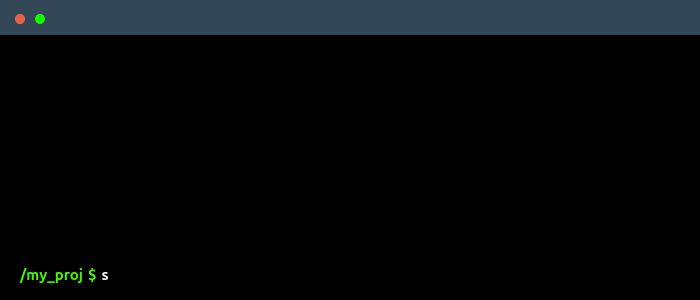

<!--
    Hi, I'm Aryahi Nittur!
    Happy to see you here exploring my README code
    You may also want to connect with me on LinkedIn @aryahi-nittur
-->

 

<!--
    Terminal GIF can be created here -> https://www.terminalgif.com
-->

    

<!--
     This is the list of my skills and tools I am studying!
-->
### Main skills

### Studying

<!--
     Fast links to my socials!
-->

### Connect with me!

    

<!--
     Oh, hello there, recruiters!
-->
