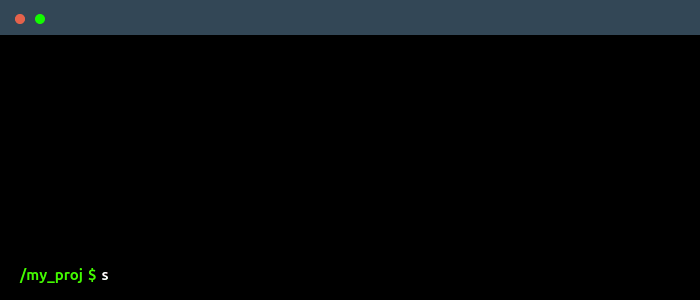

<!--
    Hi, I'm Aryahi Nittur!
    Happy to see you here exploring my README code
    You may also want to connect with me on LinkedIn @aryahi-nittur
-->

<!--
    Terminal GIF can be created here -> https://www.terminalgif.com
-->

  

<!--
    This is the list of my skills and tools I am studying!
-->

<h3>Main Skills</h3>

<!--
    Fast links to my socials!
-->

<h3>Connect with Me!</h3>

